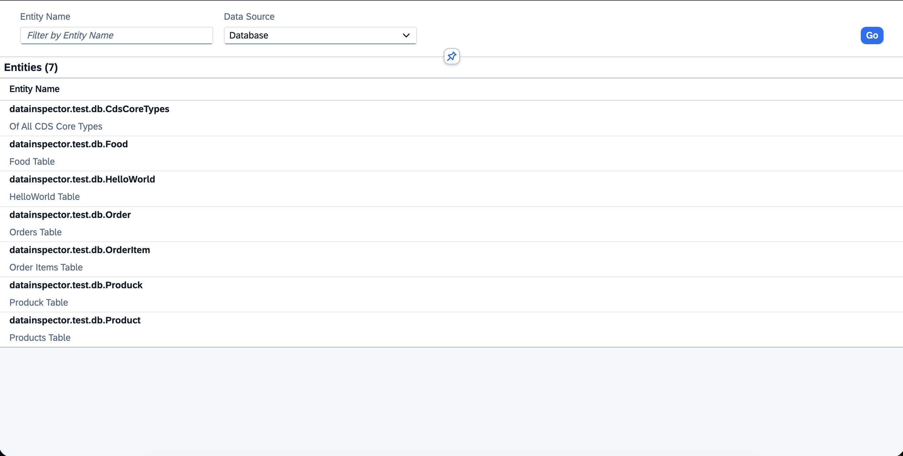
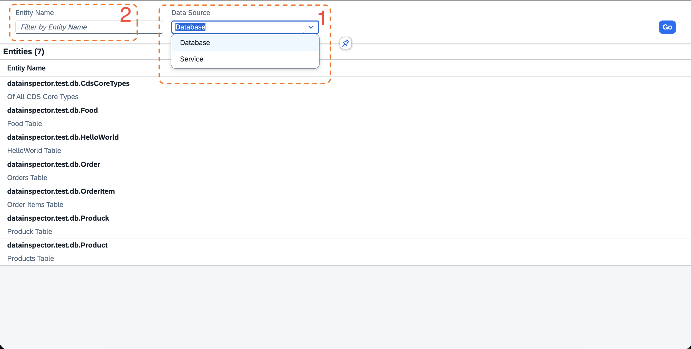
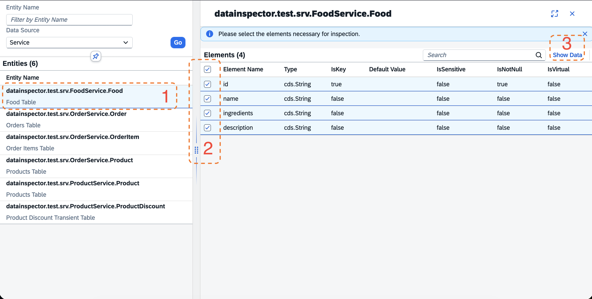
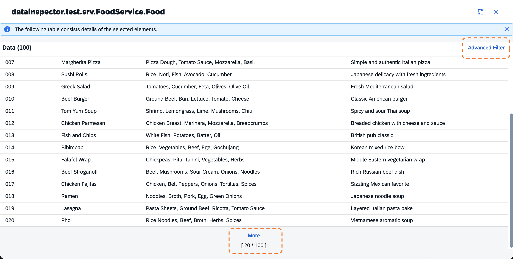
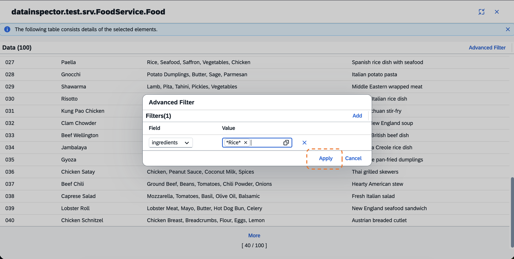
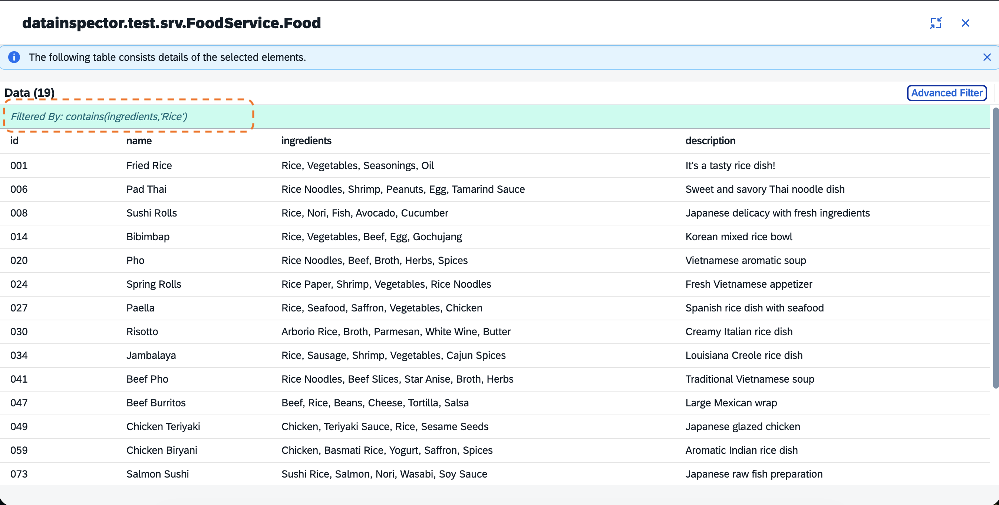

[](https://api.reuse.software/info/github.com/cap-js/data-inspector)

# SAP Cloud Application Programming Model Data Inspector Plugin for Node.js

- [SAP Cloud Application Programming Model Data Inspector Plugin for Node.js](#sap-cloud-application-programming-model-data-inspector-plugin-for-nodejs)
  - [About this Project](#about-this-project)
    - [Features](#features)
  - [Testing the Plugin Directly](#testing-the-plugin-directly)
  - [Data Inspector Plugin UI at a Glance](#data-inspector-plugin-ui-at-a-glance)
  - [Prerequisites](#prerequisites)
  - [Setup](#setup)
    - [Installation](#installation)
    - [Setup with `cds add data-inspector`](#setup-with-cds-add-data-inspector)
    - [Authorization](#authorization)
    - [Excluding Entities and Elements](#excluding-entities-and-elements)
    - [Audit Logging](#audit-logging)
    - [Data Inspector SAPUI5 App Deployment to SAP BTP](#data-inspector-sapui5-app-deployment-to-sap-btp)
      - [CDS Build Plugin](#cds-build-plugin)
        - [Custom Destination Name](#custom-destination-name)
        - [sap.cloud.service Configuration](#sapcloudservice-configuration)
      - [MTA Deployment](#mta-deployment)
      - [@sap/html5-app-deployer](#saphtml5-app-deployer)
      - [Cloud Portal Service Configuration](#cloud-portal-service-configuration)
      - [SAP Build Work Zone Configuration](#sap-build-work-zone-configuration)
    - [(Optional) flpSandbox.html Configuration for Data Inspector Plugin's SAPUI5 App Tile for Local Testing](#optional-flpsandboxhtml-configuration-for-data-inspector-plugins-sapui5-app-tile-for-local-testing)
  - [Support, Feedback, and Contribution](#support-feedback-and-contribution)
  - [Security / Disclosure](#security--disclosure)
  - [Code of Conduct](#code-of-conduct)
  - [Licensing](#licensing)

## About this Project

`@cap-js/data-inspector` is an SAP Cloud Application Programming Model (CAP) Node.js plugin to view data content of core data services (CDS) [`entities`](https://cap.cloud.sap/docs/cds/cdl#entity-definitions) defined in a SAP Cloud Application Programming Model Node.js application. It comes with an SAPUI5 app consumable out of the box.

### Features

- Provide `xsuaa` scope for access control. See [Authorization](#authorization).
- Exclude specific entities and elements from being exposed by the plugin. See [Excluding Entities and Elements](#excluding-entities-and-elements).
- Automatically log access to sensitive personal data using [`@cap-js/audit-logging`](https://github.com/cap-js/audit-logging#readme). See [Audit Logging](#audit-logging).

## Testing the Plugin Directly

To quickly test and experience the plugin directly without a dependent project in your local machine, use the NPM test workspace included in this repository.

1. Clone the repository: `git clone https://github.com/cap-js/data-inspector.git`
2. Install the dependencies: `npm i`
3. Generate core data services (CDS) model types by saving any `.cds` file from VS Code. For more details, refer to [CDS Typer](https://cap.cloud.sap/docs/tools/cds-typer).
4. Create the test sqlite db:
   1. `cd test`
   2. `cds deploy -2 sqlite:db/testservice.db`
   3. `cd ..`
5. Run the test server: `npm run dev`

   The SAPUI5 app is launched in a web browser.

6. Use the following credentials:

   Username: `alice`

   Password: keep empty

## Data Inspector Plugin UI at a Glance

1. **The landing page:**



2. **Finding an entity**:
   1. Use the `Data Source` drop down menu.
      > `Database` is raw data that exists in the database.
      > `Service` is data that is served by the CDS services.
   2. Use the `Entity Name` search field.



3. **Selecting elements of an entity for inspection**:
   1. Select the entity to show the elements. They appear as a second column on the screen.
   2. Use the checkboxes to select your desired elements.
   3. Choose `Show Data` to display the data content.



4. **Viewing the data content of the selected elements**:

   After choosing `Show Data`, the third column appears and automatically expands into fullscreen, showing the data of the selected elements. Choose `More` to load the next page of the data. Choose `Advanced Filter` to bring up the filter dialog.



5. **Adding filter conditions in the Advanced Filter dialog**:

   Add your filter conditions in the filter dialog and choose `Apply`.



6. **Viewing filtered data**:

   The filtered data is displayed.



**Recommendation**:

Select only the required columns and add filters to limit the data that is displayed.

## Prerequisites

1. Ensure your project uses `@sap/cds` version 9.
2. Set up the `xsuaa` SAP BTP service for authorization.
3. Optionally, add [`@cap-js/audit-logging`](https://github.com/cap-js/audit-logging#readme) and the `auditlog` SAP BTP service for audit logging.

## Setup

### Installation

_Internal npm registry detail to be added until publishing at npmjs.com_

Install the plugin in your SAP Cloud Application Programming Model Node.js project.

```sh
npm install @cap-js/data-inspector
```

Running your project locally with `cds serve` or `cds watch` serves the SAPUI5 app on the `@sap/cds` web application endpoint `/data-inspector-ui`. Make sure to add necessary authorization scope to your mock user. See [Authorization](#authorization).

### Setup with `cds add data-inspector`

Run `cds add data-inspector` to automatically add `@cap-js/data-inspector` configuration to your project.

> Note: Running `cds add data-inspector` is optional. To add the required configuration manually, refer to the relevant sections in this document.

The following changes are applied by `cds add data-inspector`:

- **XSUAA** (when a `xs-security.json` file exists): Adds the `xsuaa` scope `capDataInspectorReadonly` to your `xs-security.json`. Make sure to use this scope in appropriate role collections. See [Authorization](#authorization).
- **MTA** (when a `mta.yaml` file exists): Adds the data-inspector HTML5 module and artifact to your `mta.yaml`. See [MTA Deployment](#mta-deployment).
  - Adds `html5` module `capjsdatainspectorapp` pointing to the SAPUI5 app in `gen/cap-js-data-inspector-ui`.
  - Adds the `capjsdatainspectorapp` artifact to the HTML5 content module (the `com.sap.application.content` module that targets your `html5-apps-repo` `app-host` resource).
- **Cloud Portal Service** (when detected in a `mta.yaml` file and a `portal-site/CommonDataModel.json` file exists): Adds `catalog` and `group` configuration for the data-inspector tile to your `CommonDataModel.json` file, and creates an i18n properties file for translatable titles. See [Cloud Portal Service Configuration](#cloud-portal-service-configuration).

### Authorization

Define and use the `xsuaa` scope `capDataInspectorReadonly` in your `xs-security.json` file to grant read access to the plugin's SAPUI5 app and the underlying OData service. For local development and testing, add the scope `capDataInspectorReadonly` to your mock user. For setting up a mock user, refer to the [Capire documentation](https://cap.cloud.sap/docs/guides/security/authentication#mock-user-authentication).

> Note: Running `cds add data-inspector` adds the scope `capDataInspectorReadonly` in your `xs-security.json` automatically. Make sure to use this in your prefered `roles` and `role-collections`.

> Note: `@cap-js/data-inspector` reads data only through the available CDS services, exposing data based on `xsuaa` scopes granted to the entities and the user. It doesn't implement own access control. It doesn't perform any direct SQL queries.

### Excluding Entities and Elements

To hide entities or elements from the Data Inspector, annotate them with `@HideFromDataInspector` in your CDS definitions.

**Example**

Using `@HideFromDataInspector` annotation in the CDS entity definitions:

```cds
entity Foo {
    id   : String;
    name : String @HideFromDataInspector;
}
```

The `name` element of the `Foo` entity is not revealed by `@cap-js/data-inspector`.

```cds
@HideFromDataInspector
entity Bar {
    id   : String;
    name : String;
}
```

The `Bar` entity is not revealed by `@cap-js/data-inspector`.

### Audit Logging

If your SAP Cloud Application Programming Model Node.js application uses the [`@cap-js/audit-logging`](https://github.com/cap-js/audit-logging#readme) plugin, `@cap-js/data-inspector` automatically emits audit logs for read access to sensitive data elements annotated with `@PersonalData.IsPotentiallySensitive`. For audit logging in SAP Cloud Application Programming Model, refer to the [Capire documentation](https://cap.cloud.sap/docs/guides/data-privacy/annotations).

### Data Inspector SAPUI5 App Deployment to SAP BTP

#### CDS Build Plugin

`@cap-js/data-inspector` ships a CDS build plugin that runs during your `cds build`. The plugin:

1. **Copies** the SAPUI5 app source from the plugin package into your project's `gen/cap-js-data-inspector-ui` directory.
2. **Patches the SAPUI5 app's `xs-app.json` file** with your Node.js OData server destination name when a value is available from `cds.env` or auto-detected from an existing SAPUI5 app in your project. For more information, see [Custom Destination Name](#custom-destination-name).
3. **Patches the SAPUI5 app's `manifest.json` file** with `sap.cloud.service` when a value is available from `cds.env` or auto-detected from an existing SAPUI5 app in your project. For more information, see [sap.cloud.service Configuration](#sapcloudservice-configuration).

The resulting `gen/cap-js-data-inspector-ui` folder is the single source of truth for deployment, whether you use [MTA-based deployment](#mta-deployment) or [`@sap/html5-app-deployer`](#saphtml5-app-deployer).

##### Custom Destination Name

The default OData route destination is `srv-api`. If your project uses a different destination name, the build plugin resolves it automatically in this order:

1. **Explicit configuration** — Set `cds.data-inspector.destination` in your `.cdsrc.json` file or `package.json` file:

   ```json
   {
     "cds": {
       "data-inspector": {
         "destination": "my-custom-srv-api"
       }
     }
   }
   ```

2. **Auto-detection** — The plugin scans your existing `app/*/xs-app.json` file for an OData route and uses its destination value.

3. **Default** — This falls back to `srv-api`.

##### sap.cloud.service Configuration

The `sap.cloud.service` property in the SAPUI5 app's `manifest.json` file is required for SAP Build Work Zone. The [`cds build`](#cds-build-plugin) plugin patches this value automatically when available:

1. **Explicit configuration** — Set `cds.data-inspector.cloudService` in your `.cdsrc.json` file or `package.json` file:

   ```json
   {
     "cds": {
       "data-inspector": {
         "cloudService": "my.cloud.service"
       }
     }
   }
   ```

2. **Auto-detection** — The plugin scans your existing `app/*/webapp/manifest.json` file for an existing `sap.cloud.service` value and uses it.

3. **Skipped** — If neither source provides a value, `sap.cloud.service` is not added in the SAPUI5 app's `manifest.json` file.

#### MTA Deployment

> Note: Running `cds add data-inspector` adds the following required configurations in your `mta.yaml` file automatically. Make sure to review the produced changes before committing.

The data-inspector plugin's SAPUI5 app produced by [`cds build`](#cds-build-plugin) in your project's `gen/cap-js-data-inspector-ui` directory must be referenced by an `html5` module in your `mta.yaml` file and included in the HTML5 content module for deployment to the `HTML5 Application Repository` service.

1. Add an `html5` module as follows:

```yaml
- name: capjsdatainspectorapp
  type: html5
  path: gen/cap-js-data-inspector-ui
  build-parameters:
    build-result: dist
    builder: custom
    commands:
      - npm install
      - npm run build:cf
    supported-platforms: []
```

2. Include the `html5` module in your HTML5 content module — the `com.sap.application.content` module that targets your `html5-apps-repo` `app-host` resource. For example:

```yaml
- name: <your app content module name>
  type: com.sap.application.content
  path: <your app content module path>
  requires:
    - name: <your html5-apps-repo app-host resource name>
      parameters:
        content-target: true
  build-parameters:
    build-result: <your module build output path>
    requires:
      - name: capjsdatainspectorapp
        artifacts:
          - datainspectorapp.zip
        target-path: <your html5 app artifact build output path>
```

#### @sap/html5-app-deployer

For deployment with [`@sap/html5-app-deployer`](https://www.npmjs.com/package/@sap/html5-app-deployer), use the source of the SAPUI5 app produced by [`cds build`](#cds-build-plugin) in your `gen/cap-js-data-inspector-ui` directory to include when creating your `html5-app-deployer` image.

1. Run `cds build` to produce the patched data-inspector plugin's SAPUI5 app in your project's `gen/cap-js-data-inspector-ui` directory.
2. Build the SAPUI5 app for production: `cd gen/cap-js-data-inspector-ui && npm install && npm run build:cf`.
3. Include the resulting `dist/` contents (specifically `datainspectorapp.zip`) in your `html5-app-deployer` image alongside your other SAPUI5 apps.

The exact steps depend on your deployment pipeline. For details, refer to [Deploy Content Using HTML5 Application Deployer](https://help.sap.com/docs/btp/sap-business-technology-platform/deploy-content-using-html5-application-deployer).

#### Cloud Portal Service Configuration

> Note: Running `cds add data-inspector` adds the following required configurations in your `portal-site/CommonDataModel.json` automatically if Cloud Portal service is detected in your `mta.yaml` file (`service: portal`, `service-plan: standard`). Make sure to review the produced changes before committing.

Perform the following steps to configure the data-inspector tile:

1. Add a **catalog** and a **group** entry for the data-inspector plugin's SAPUI5 application tile to your `portal-site/CommonDataModel.json` file.

In an existing `catalog` (`payload.catalogs[*].payload.viz`):

```json
{
  "appId": "sap.cap.datainspector.datainspectorui",
  "vizId": "datainspectorui-display"
}
```

In an existing `group` (`payload.groups[*].payload.viz`):

```json
{
  "id": "sap.cap.datainspector.datainspectorui",
  "appId": "sap.cap.datainspector.datainspectorui",
  "vizId": "datainspectorui-display"
}
```

You can also create a new `catalog` and `group` for the data-inspector tile. `cds add data-inspector` does this. For example:

```json
{
  "payload": {
    "catalogs": [
      {
        "_version": "3.0.0",
        "identification": {
          "id": "capDataInspectorCatalogId",
          "title": "Data Inspector",
          "entityType": "catalog",
          "i18n": "your_i18n_file_path"
        },
        "payload": {
          "viz": [
            {
              "appId": "sap.cap.datainspector.datainspectorui",
              "vizId": "datainspectorui-display"
            }
          ]
        }
      }
    ],
    "groups": [
      {
        "_version": "3.0.0",
        "identification": {
          "id": "capDataInspectorGroupId",
          "title": "Data Inspector",
          "entityType": "group",
          "i18n": "your_i18n_file_path"
        },
        "payload": {
          "viz": [
            {
              "id": "sap.cap.datainspector.datainspectorui",
              "appId": "sap.cap.datainspector.datainspectorui",
              "vizId": "datainspectorui-display"
            }
          ]
        }
      }
    ]
  }
}
```

2. Create an **i18n properties file** with translatable titles for the catalog and group entries. `cds add data-inspector` does this automatically.
3. Append the `capDataInspectorGroupId` group ID to your preferred site's `groupsOrder` so that the tile is visible by default in SAP Fiori launchpad. `cds add data-inspector` does this automatically only if exactly one `site` entity is found. If you have multiple sites, manually add the group ID to `groupsOrder` in your preferred site after running `cds add data-inspector`.

#### SAP Build Work Zone Configuration

If you use **SAP Build Work Zone**, you must add the data-inspector plugin's SAPUI5 app manually to the SAP Build Work Zone CDM configuration file (`cdm.json`). The `sap.cloud.service` value in the `manifest.json` file of the plugin's SAPUI5 app should already be [patched by the `cds build` plugin](#sapcloudservice-configuration) to work with **SAP Build Work Zone**.

Depending on your Workzone content model, you may need to:

- Add the app to a **catalog** entity for discoverability.
- Reference the catalog in a **role** entity to control access.
- Include the group in a **space** or **workpage** for navigation.

Ensure the following values for `appId` and `vizId` are set for the plugin's SAPUI5 app in your `cdm.json` file.

```json
"viz": {
  "appId": "sap.cap.datainspector.datainspectorui",
  "vizId": "datainspectorui-display"
}
```

For details on the CDM content structure, refer to the [SAP Build Work Zone documentation](https://help.sap.com/docs/build-work-zone-standard-edition).

### (Optional) flpSandbox.html Configuration for Data Inspector Plugin's SAPUI5 App Tile for Local Testing

If you are using an `flpSandbox.html` to test locally, add the data-inspector plugin's SAPUI5 app tile in the sandbox SAP Fiori launchpad.

In `ClientSideTargetResolution.adapter.config.inbounds`:

```js
CAPDataInspectorDisplay: {
  semanticObject: "datainspectorui",
  action: "display",
  signature: {
    parameters: {},
    additionalParameters: "ignored"
  },
  resolutionResult: {
    additionalInformation: "sap.cap.datainspector.datainspectorui",
    applicationType: "URL",
    url: "/data-inspector-ui"
  }
}
```

In `LaunchPage.adapter.config.groups`:

```js
{
  id: "Supportability",
  title: "Support Tools",
  isPreset: true,
  isVisible: true,
  isGroupLocked: false,
  tiles: [
    {
      id: "CAPDataInspector",
      tileType: "sap.ushell.ui.tile.StaticTile",
      properties: {
        title: "Data Inspector",
        targetURL: "#datainspectorui-display",
        icon: "sap-icon://database"
      }
    }
  ]
}
```

## Support, Feedback, and Contribution

This project is open to feature requests, suggestions, and bug reports through [GitHub issues](https://github.com/cap-js/<your-project>/issues). We encourage and welcome contribution and feedback. For more information about how to contribute, the project structure, and additional contribution information, see the [Contribution Guidelines](CONTRIBUTING.md).

## Security / Disclosure

If you find a bug that might be a security problem, follow the instructions in our [security policy](https://github.com/cap-js/<your-project>/security/policy) to report it. Don't create GitHub issues for security-related questions or problems.

## Code of Conduct

Members, contributors, and leaders pledge to make participation in our community a harassment-free experience for everyone. By participating in this project, you agree to abide by its [Code of Conduct](https://github.com/cap-js/.github/blob/main/CODE_OF_CONDUCT.md) at all times.

## Licensing

Copyright 2025 SAP SE or an SAP affiliate company and data-inspector contributors. Please see our [LICENSE](LICENSE) for copyright and license information. Detailed information including third-party components and their licensing/copyright information is available through the [REUSE tool](https://api.reuse.software/info/github.com/cap-js/<your-project>)
